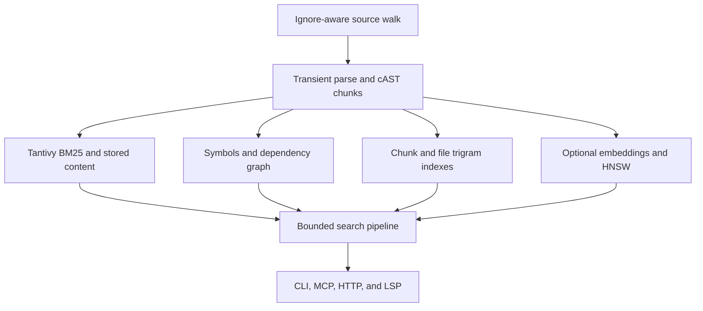

# Codixing architecture, scale, context, and distribution review

Date: 2026-07-17
Baseline revision: `76e1faa64f93fcaa1449f928dd28e61b6b95fcb0`
Implementation branch: `codex/large-repos-context-install`

## Executive outcome

Codixing already had a capable retrieval core: multi-language parsing, cAST
chunking, Tantivy BM25, exact trigram lookup, symbol/dependency graphs, optional
vectors, incremental sync, and CLI/MCP/LSP/HTTP clients. Its main scale risks
were at the seams between those systems:

- initialization retained several full-corpus representations at once and
  repeatedly parsed the same source;
- reopened Exact/vector/graph search could repeatedly scan all stored Tantivy
  documents to hydrate a small result set;
- sync could lose its authoritative hash baseline or mark a failed per-file
  update as current;
- vector persistence was vulnerable to interrupted writes and concurrent
  snapshot cleanup;
- MCP advertised a broad tool catalog by default and lacked a final,
  unconditional output-size invariant;
- file APIs had inconsistent path containment, especially around symlinks;
- shell, npm, VS Code, plugin, and release metadata had drifted into separate
  installation stories.

This branch fixes those correctness and bounded-work problems, hardens the
complete distribution transaction, and adds regression coverage. On an
identical 341-file source snapshot, fresh indexing became 36% faster with 31%
lower peak RSS. Reopened Exact lookup became 3.6x to 35.9x faster. The default
MCP schema response became 77% smaller.

The remaining work for genuinely enormous repositories is architectural rather
than a collection of small optimizations: persisted reverse indexes, segmented
incremental artifacts, bounded graph ranking, columnar metadata, streaming
discovery, and a 100K-file performance gate.

## System model

| Area | Responsibility |
|---|---|
| `crates/core` | Discovery, parsing, chunking, retrieval, graph, persistence, sync, formatting, context assembly |
| `crates/cli` | Index/search/sync/analysis commands and daemon proxy |
| `crates/mcp` | JSON-RPC server, exposure profiles, generated schemas, bounded tool handlers |
| `crates/server` | HTTP API |
| `crates/lsp` | Editor language-server integration |
| `npm` | Download-and-run wrapper for `codixing-mcp` |
| `editors/vscode` | VS Code commands and LSP integration |
| `docs/install.sh` | Verified four-binary installer |

Initialization discovers supported files with ignore rules, parses them in a
bounded parallel pass, writes chunks to Tantivy, and extracts symbols/imports/
calls from the same parse tree. Auxiliary graph and trigram artifacts are then
persisted. Compact chunk metadata remains resident; full chunk bodies are
hydrated from Tantivy only when a retrieval stage needs them.

Search selects Instant, Fast, Thorough, Explore, Deep, Exact, or Semantic
retrieval. Pipeline stages add graph/recency behavior only for strategies that
need it, then a token-aware formatter produces bounded caller context.

## Reproducible before/after evidence

Both binaries report v0.45.0. The baseline binary was built from the reviewed
main revision and the candidate from this branch in optimized mode. Each fresh
index used the same source snapshot: 341 files, 3,304 chunks, 5,066 symbols, no
vectors. Measurements used a warm filesystem cache but a fresh process and, for
indexing, a fresh `.codixing` directory. Peak RSS comes from child-process
`getrusage`.

| Fresh-index measurement | Baseline | Candidate | Change |
|---|---:|---:|---:|
| Wall time | 4.139 s | 2.660 s | -35.7% |
| Reported indexing phase | 3.80 s | 2.56 s | -32.6% |
| Peak RSS | 341.7 MiB | 235.7 MiB | -31.0% |

A separate ingestion stress fixture replicated ten source modules under
path-distinct roots, producing 3,360 files, 31,600 chunks, and 4,845 symbols.
It measures indexing throughput and memory growth, not retrieval quality or
diversity on an independently authored large corpus.

| Synthetic scale measurement | Baseline | Candidate | Change |
|---|---:|---:|---:|
| Wall time | 37.761 s | 16.845 s | -55.4% |
| Reported indexing phase | 36.27 s | 16.64 s | -54.1% |
| Peak RSS | 2,012 MiB | 951.0 MiB | -52.7% |

Each Exact query reopened the index in a new process and discarded terminal
rendering from the timed region only after the process emitted it.

| Exact query | Baseline | Candidate | Speedup |
|---|---:|---:|---:|
| `pub` | 6.900 s | 0.256 s | 27.0x |
| `String` | 7.968 s | 0.222 s | 35.9x |
| `Engine` | 3.427 s | 0.162 s | 21.2x |
| `token_budget` | 0.870 s | 0.242 s | 3.6x |

A no-op filesystem sync stayed effectively unchanged (0.113 s baseline versus
0.117 s candidate, with about 32 MiB RSS). The patch targets changed-file work,
hydration, and correctness rather than making the already-stat-only no-op path
look artificially faster.

MCP `tools/list` arrays were parsed from raw responses and compact-serialized
consistently for byte comparison:

| Server/profile | Tools | Serialized tool-schema bytes |
|---|---:|---:|
| Baseline default (`reviewer`) | 55 | 36,678 |
| Candidate default (`minimal`) | 10 | 8,384 |
| Candidate `reviewer` | 51 | 38,225 |
| Candidate `editor` | 68 | 48,005 |
| Candidate `dangerous` | 70 | 48,963 |

The default catalog is 77.1% smaller in bytes and exposes 81.8% fewer tools.
Reviewer remains an explicit per-connection choice; write profiles additionally
require an appropriate startup ceiling.

## Improvements implemented

### 1. Bounded-memory indexing

- Parsing uses transient trees instead of retaining a corpus AST cache.
- Definitions, references, imports, and calls reuse the tree already produced
  for chunking; supported source is no longer parsed repeatedly for graph work.
- Successful hashes are captured in the indexing pass.
- Full-file content is no longer duplicated in a corpus-wide map. The file
  trigram builder uses a bounded second file pass, normally served by the OS
  page cache.
- Embedding preparation stores pending chunk IDs, not cloned chunk bodies.
- Parse-phase maps, builders, and resident chunk bodies are dropped at their
  last durable consumer.
- Auxiliary construction data is reopened lazily from its compact persisted
  representation.

### 2. Indexed content hydration and bounded ranking

- Tantivy hydration now uses an indexed exact `chunk_id` `TermSetQuery`.
- Exact retrieval hydrates candidates in fixed-size batches and maintains a
  deterministic bounded global top-k rather than materializing every body.
- Vector retrieval and graph propagation batch missing bodies too.
- Git recency is initialized only for Fast and Thorough search.
- Tests cover requested/missing/deleted IDs, reopened Exact search, ordering,
  and compact-metadata operation.

This removes the former approximately `O(candidate_count * corpus_chunks)`
reopened Exact path.

### 3. Correct incremental state

- A complete authoritative file-hash snapshot is established at init.
- Generic `save()` preserves that snapshot instead of replacing it with only
  parser entries touched by the current process.
- Filesystem sync owns complete snapshots; Git sync merges a conservative,
  successful delta.
- Failed per-file changes do not advance hashes or signatures, so a later sync
  retries them instead of preserving stale/ghost entries.
- Old bodies are hydrated before mutating compact trigram indexes.
- Auxiliary persistence failures that would make reopened state inconsistent
  are surfaced or safely reopened rather than silently ignored.

### 4. Durable embedding lifecycle

- `codixing embed` can bootstrap vectors from a BM25-only index, stream stored
  content file by file, and checkpoint long work.
- `init --embed` waits by default; a short-lived CLI no longer abandons a
  background vector build.
- Vector indexes use generation-based atomic snapshots, validate and fall back
  to the newest complete generation, and retain legacy-read compatibility.
- Concurrent snapshot cleanup only removes generations that predate the
  publishing writer, preventing one successful save from deleting another.
- The optional `rustqueue` primitives remain feature-gated and experimental;
  the normal engine no longer opens an unused queue database.

### 5. Context control

- MCP defaults to `minimal` in the binary, daemon discovery, examples, and
  Claude plugin.
- The startup profile is now a real safety ceiling. Minimal/reviewer processes
  remain read-only unless started with `--allow-profile-escalation`; daemon
  endpoints are policy-distinct, and Unix daemon sockets are chmodded to 0600.
- JSON-RPC input uses an 8 MiB frame ceiling with drain-and-realign behavior,
  correct parse/invalid-request error codes, and bounded/redacted request logs.
- Every MCP read/write dispatch passes an unconditional final envelope: 4,000
  tokens by default, hard-clamped to 12,000.
- Query length, result count, explicit reformulations, graph depth, arrays,
  strings, patches, line ranges, and time budgets are clamped before expensive
  work.
- Truncation is UTF-8 safe, includes its marker inside the budget, and preserves
  valid JSON-RPC omission envelopes.
- `code_search` exposes its budget. Repository staleness is opt-in rather than
  an unconditional search-hot-path scan.
- File ranges stream with a fixed buffer and handle huge single lines without
  loading the complete file.
- Progress tokens and subprocess capture are bounded. `search_usages` complete
  mode is deterministic and pageable with total-within-scan, `has_more`, and
  `next_offset` metadata under a 100,000-candidate-chunk ceiling.
- The formatter emits useful partial first results while enforcing the exact
  final token count.

### 6. Root containment

- Core, MCP, and LSP routes canonicalize existing files against the configured
  primary/extra roots.
- Write/create paths validate every existing prefix, reject parent traversal,
  escaped and dangling symlinks, and only permit a missing suffix below a safe
  ancestor.
- Rename, patch, cascade reindex, URI handling, and source discovery share the
  same containment invariant; lexical `root.join(...)` fallbacks are removed.
- Regression tests exercise traversal and symlink escapes.

### 7. Installation and editor experience

- The shell installer stages and checksum-verifies all four binaries, validates
  version and nonzero size, publishes as one transaction, rolls back on failure,
  and serializes same-directory installs with a lock.
- Version probes are limited to safe CLI/MCP binaries; LSP/server are validated
  without accidentally starting long-running processes.
- The npm wrapper uses bounded redirects/body/metadata, one timeout budget,
  unique temporary files, SHA-256 verification, atomic replacement, rollback,
  bounded revalidation, and signal forwarding. It advertises only release-built
  platforms and requires Node 18+.
- VS Code refuses activation in untrusted workspaces, uses current CLI flags,
  and now shares version 0.45.0 with the release transaction.
- Version bumping/checking covers 14 exact fields across seven files while
  preserving dependency versions and rolling back partial changes.
- Claude hooks degrade safely when the CLI or `jq` is absent and construct JSON
  arguments without shell interpolation.
- ONNX setup now explains that `ORT_DYLIB_PATH` must be the exact shared-library
  file, not an assumed fixed directory, and points users to `codixing doctor`.

### 8. Release transaction and benchmark integrity

- CI enforces the declared Rust 1.88 MSRV and a separate current stable matrix.
- Tagging verifies the tested SHA is still current `main` and publishes main/tag
  atomically with a lease.
- Releases validate the exact tag and expected CI artifacts, include binaries,
  checksums, VSIX, npm, plugin, and Pages, serialize globally, reject older
  semver, and make same-tag reruns verification-only.
- The composite action uses the installer from its checked-out action snapshot,
  not a mutable remote script.
- npm publication compares the exact pre-publish and public tarball contents;
  ambiguous publish failures do not hide an artifact that may already be
  publicly available.
- Benchmark subprocess output is bounded and drained concurrently; nonzero,
  timeout, and overflow outcomes fail loudly. Repositories are not mutated
  during list filtering, grep is recursive/bounded, and retrieval reports record
  index type/model instead of making unsupported end-to-end agent claims.

## Remaining priority roadmap

### P1: 100K+ files and million-chunk indexes

1. Persist dense reverse indexes for file-to-chunks, file-to-symbols,
   file-to-graph-nodes, and stable external chunk IDs.
2. Replace per-edit full artifact rewrites with immutable base segments,
   append-only deltas/tombstones, and background compaction.
3. Replace full-graph personalized PageRank maps with dense CSR adjacency and a
   bounded local expansion/approximate-PPR cache keyed by graph generation.
4. Move compact chunk metadata to a columnar mmap layout with interned paths,
   languages, scopes, and signatures.
5. Stream discovery through a bounded producer/consumer pipeline instead of
   collecting every source path before parsing.
6. Add `max_file_bytes` plus explicit diagnostics for generated/minified
   monsters before parser/trigram allocation.
7. Add a release gate at 10K/100K files covering cold open/init, peak RSS,
   1/10/100-file edits, disk amplification, ordering hashes, and interrupted
   persistence recovery.

### P1: structured context, not just truncation

1. Extend the cursor/omitted-count model now used by complete
   `search_usages` to other potentially broad handlers.
2. Persist file-scoped symbol lookup to remove remaining repo-map/focus/evidence
   paths that scan broad symbol sets.
3. Preserve global relevance when merging formatter spans and never imply
   adjacency across omitted lines.
4. Normalize repeated paths/signatures behind evidence IDs and emit executable
   structured next calls.
5. Apply one response-envelope model to MCP, HTTP, CLI, and daemon output; HTTP
   still duplicates result content and formatted context.
6. Make the 100,000-candidate ceiling in complete usage scans visible as an
   explicit incomplete-total signal for repositories that exceed it.
7. Stream exact-grep aggregate counts without retaining even compact per-hit
   records when a pattern matches an enormous fraction of the repository.

### P2: daemon and maintenance

1. Isolate focus/session state per MCP connection, sharing only explicit
   collaboration events.
2. Replace daemon fork timing assumptions with a readiness protocol and a
   single-initializer lock for huge cold indexes.
3. Avoid mutating watchers for read-only profile engines.
4. Add explicit vector-generation garbage collection/repair and rotate session
   and shared-memory logs.
5. Use automation-managed immutable SHAs for third-party GitHub Actions.
6. Add JSON-RPC request cancellation and parallel-safe scheduling for long
   operations instead of relying only on bounded inputs and client timeouts.
7. Cache canonical root/path decisions in the LSP and define a consistent
   contained-new-file URI policy; resident document replacements are now capped
   at 8 MiB, but repeated filesystem canonicalization remains.
8. Eliminate the small Unix bind-to-chmod permission window, for example by
   creating daemon sockets under a private directory or applying a restrictive
   creation mask before bind.
9. Clean crash-orphaned vector generations by age/ownership without risking a
   concurrently published snapshot.
10. Avoid the current cold direct-process fallback when a client requests a
    non-minimal policy and only a minimal daemon is already running.
11. Add an aggregate LSP open-document byte/count ceiling with eviction; the
    8 MiB per-document limit prevents one huge replacement but does not cap a
    client that opens many distinct buffers without closing them.

## Verification

| Check | Result |
|---|---|
| `cargo test --workspace --locked` (Rust 1.88) | 1,437 passed, 0 failed, 10 ignored |
| `cargo test --workspace --no-default-features --locked` | 1,438 passed, 0 failed, 10 ignored |
| `cargo check -p codixing-core --all-features --locked` | Passed, warning-free |
| Focused `rustqueue` integration | 3 passed |
| Rust format and `git diff --check` | Passed |
| npm installer suite | 18 passed |
| Shell installer suite | Passed |
| CLI smoke suite | 23 passed |
| REST API smoke suite | 20 passed |
| MCP end-to-end script | 38 passed |
| Version transaction suite | 6 passed; all 14 fields consistent at 0.45.0 |
| VS Code TypeScript and VSIX | Compiled and packaged at 0.45.0 |
| Workflow/action YAML and embedded shell | Parsed/syntax-checked |
| README/docs command contracts | 24 command mentions and 4 flag contracts passed |

Local Clippy was unavailable in the supplied toolchain, so Clippy remains a
mandatory CI gate rather than an asserted local result. A cloud browser refused
local-file and localhost navigation; HTML was syntax/link checked, but rendered
desktop/mobile screenshots could not be completed in this environment.

## Release recommendation

Land through the draft PR and require every CI job, including MSRV, Clippy,
audit, coverage, installer, and benchmark gates. Treat the `minimal` MCP default
and waiting `init --embed` behavior as intentional user-visible changes in the
release notes. Do not describe the branch as 100K-file validated until the
scale gate above exists; the new algorithms are bounded and materially faster,
but that claim needs dedicated hardware, pinned corpora, repeated samples, and
machine-readable raw results.
